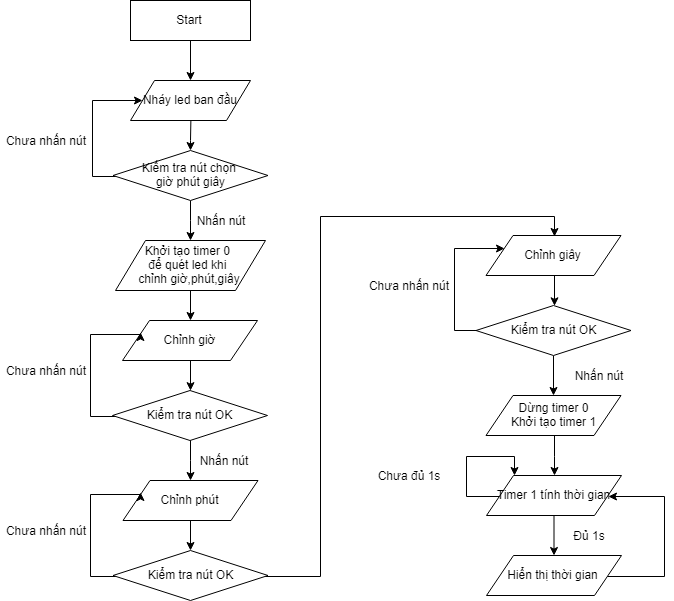
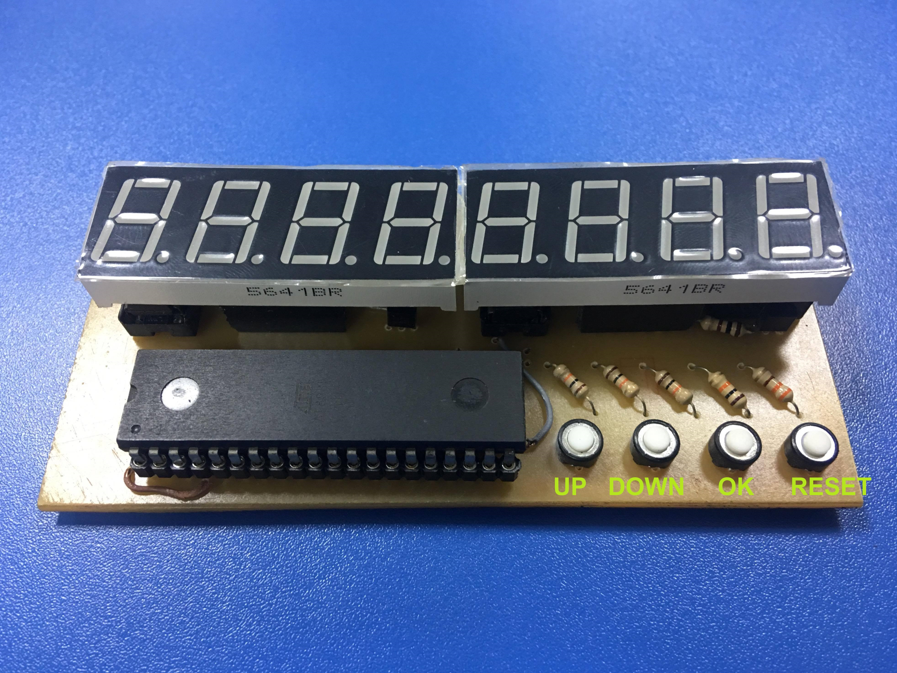

# Introduction
- Using Assembly code on AT89S52 to create a clock without using DS1307.
- I don't know how long can the clock be slow 1 minute, I have no time to test it :D but i think it can reach about 2 - 3 years because my clock is slow 1s around 15 - 25days.

# Video
- https://www.youtube.com/watch?v=ZXwfwDxMIpc&list=PL9FegcZTeB9LliIpxNh4CYu477SYDLmwC&index=12&t=0s

# References
- https://www.win.tue.nl/~aeb/comp/8051/set8051.html
- http://www.keil.com/support/man/docs/is51/is51_mov.htm

# User manual

- PRESS and HOLD OK button to access selection mode
- Press up or down to choose hour,minutes,second . Each digit selection you have to press OK button to ACCEPT 
- After done all of selecting time , PRESS OK button and look if the BLUE led is ON , the clock will be run after that.
- FlowChart:

- Real Circuit: 

